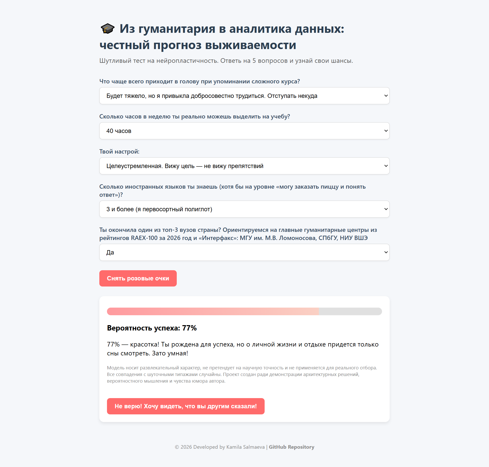
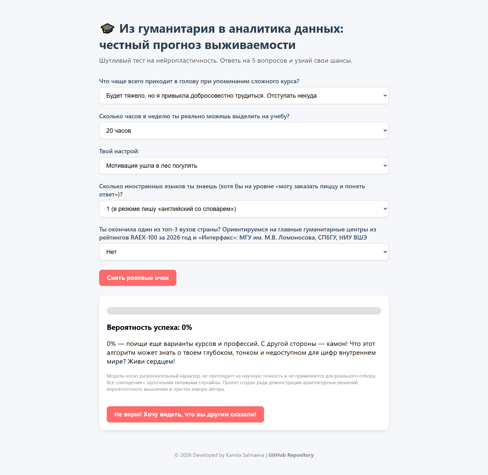
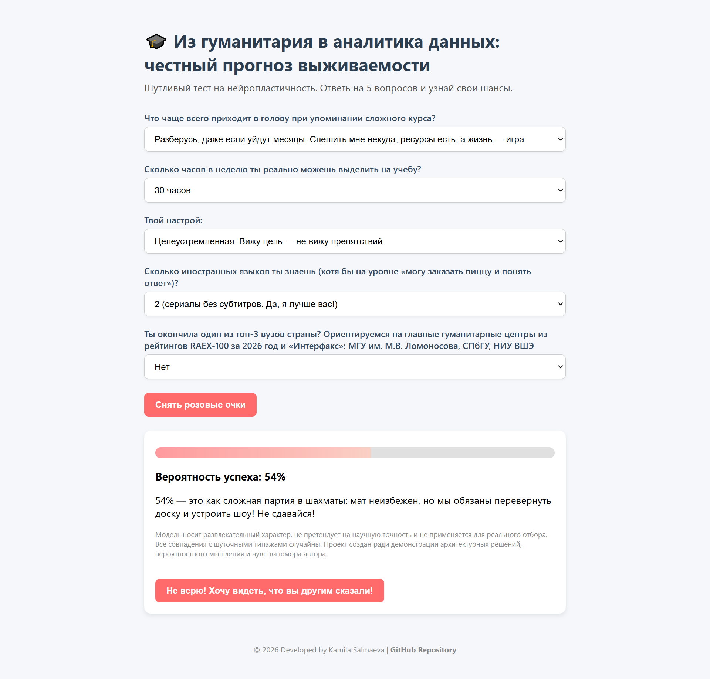
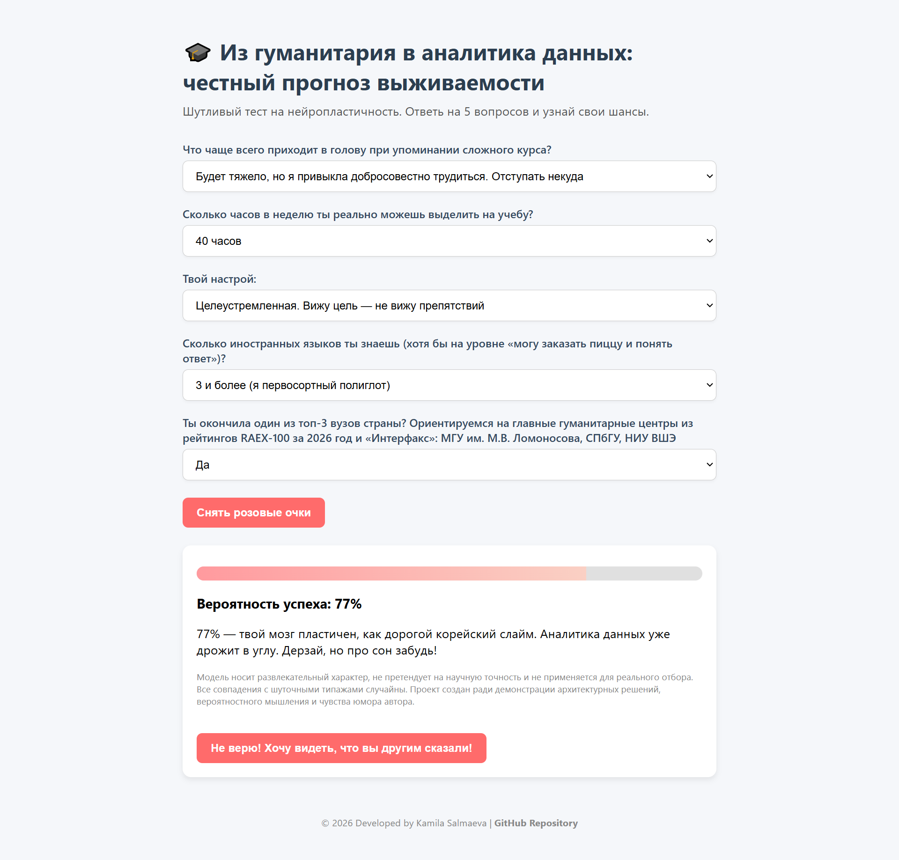
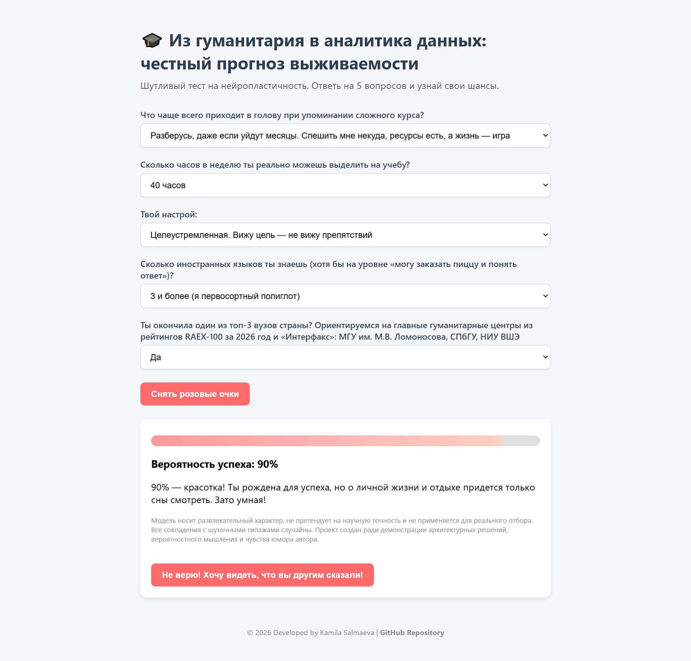

# Из гуманитария в аналитика данных: честный прогноз выживаемости

ℹ️ **Note:** This project is written in Russian.

**Живое демо (основная ссылка):** [GitHub Pages](https://kamila-salmaeva.github.io/humanities-data-analytics-scoring/)  
**Зеркало на Hugging Face:** [Hugging Face Space](https://huggingface.co/spaces/kamilasv/humanities-data-analytics-scoring)  

Когда на курсе по Python уже на третьем занятии начались циклы, я пережила классический для новичка шок. Но создание абстрактных миров с помощью кода в итоге понравилось мне больше, чем написание запросов на SQL. Я решила объединить лаконичность и минимализм Python со своей любовью к психологии — так появился первый набросок пет-проекта, построенный на словарях и условиях `if-else`.

Позже, погрузившись в теорию вероятностей, я поняла, как работает математическая логика сложения и умножения вероятностей (логических операторов `ИЛИ` и `И`). Это позволило мне полностью переосмыслить расчетную модель проекта и сделать ее более точной.

---

## О проекте

Этот проект — юмористический манифест, вдохновленный трендом "ИТ для всех". Когда гуманитарий решается штурмовать объективно сложное обучение аналитике данных, иллюзии разбиваются о суровую реальность: программы не рассчитаны на студентов без технического бэкграунда. Тест в игровой форме помогает трезво (но с улыбкой!) оценить свои шансы до того, как вкладывать время и силы в обучение. За любым успешным переходом в технологии стоят упорный труд, дедлайны и активация механизмов нейропластичности.

---

## Как запустить

### Локально
Скачайте репозиторий и откройте файл [index.html](index.html) в любом браузере. Никакого сервера или установки Python не требуется — все работает на чистом HTML, CSS и JavaScript. 
*Примечание: если вам интересна версия приложения на Python, ее исходный код находится в папке [streamlit_version](streamlit_version/).*

### На GitHub Pages (Основная версия)
Проект доступен по [этой прямой ссылке](https://kamila-salmaeva.github.io/humanities-data-analytics-scoring/). Приложение запускается мгновенно, без серверов и внешних зависимостей.

### На Hugging Face Spaces (Зеркало)
Проект также размещен на Hugging Face как статический сайт.  
*Примечание: основная ссылка перенесена на GitHub Pages для максимальной стабильности и быстрой загрузки (подробнее — в разделе "Архитектурные решения").*

---

## Архитектурные решения

- **Словари вероятностей** — для каждого варианта ответа экспертно назначена вероятность успеха (от 0 до 1). Логика расчета не зависит от текста вопросов: замена формулировок или весов не затрагивает алгоритм.
- **Инкапсуляция логики** — расчет вынесен в отдельную функцию, что делает его изолированным, повторяемым и тестируемым.
- **Валидация данных** — архитектура проекта изначально защищает от некорректных входных значений и отсутствующих ключей. Для браузерной версии проверку пришлось упростить, но общий инженерный принцип остался неизменным.
- **Косвенное тестирование** — пользователь выбирает простые бытовые формулировки, пока система сопоставляет их с математическими вероятностями.
- **Модель совместной вероятности** — итоговая вероятность вычисляется как произведение вероятностей четырех факторов (психотип, время, мотивация, языки). Бонус за топ-вуз применяется как мультипликативный коэффициент 1.1, после чего результат ограничивается сверху единицей.
- **Шутливая обратная связь** — для каждого уровня вероятности (гений, молодец, держись, без шансов) случайным образом выбирается одна из трех остроумно-шутливых фраз с обращением в женском роде.
- **Статическая реализация (Single Page Application, SPA)** — из-за блокировок зарубежных CDN-серверов на территории РФ было принято решение полностью отказаться от серверных платформ и браузерных эмуляторов Python (Stlite/Pyodide). Финальная рабочая версия теста переписана на чистый HTML, CSS и ванильный JavaScript. Это сделало приложение автономным, безопасным и мгновенно загружаемым без сторонних скриптов и VPN.

Исходный серверный прототип на Python и Streamlit сохранен в папке `streamlit_version/` и демонстрирует архитектурное разделение логики и данных.

---

## Почему умножение, а не сумма?

Вероятность успеха в обучении с нуля до профессионального уровня лучше моделируется как **совместная вероятность независимых событий**:

**P(успех) = P(психотип) × P(время) × P(мотивация) × P(языки) × K**, где **K** — экспертный мультипликатор: **1.1** для топ-вузов и **1** для любых других. После применения коэффициента результат ограничивается сверху значением **1.0**.

Если хотя бы по одному параметру вероятность близка к нулю, общий шанс тоже стремится к нулю. Это отражает реальность: недостаток времени или неготовность к жестким когнитивным нагрузкам невозможно компенсировать другими факторами. При обычном суммировании баллов такой блокирующий эффект смоделировать не получится. 

Логика теста опирается на теорию вероятностей: алгоритм не расширяет дорогу, а сужает окно шансов, где критически важен каждый фактор. Все веса назначены экспертно. Подробное обоснование выбора значений приведено в разделе "Архитектура модели".

### Парадокс идеального гуманитария, или почему 95% недостижимы

В коде жестко зашита верхняя граница категории "гений": `prob >= 0.95`. Но математика умножения вероятностей диктует свои условия. Если пользователь выберет идеальные ответы (каждый фактор в модели не превышает 0.95) и сработает бонус за топ-вуз, максимальное значение вероятности равно:

`0.95 × 0.95 × 0.95 × 0.95 × 1.1 = 0.895956875` (то есть **90%** на экране после округления). Поскольку `0.895956875 < 0.95`, категория гения недостижима ни при одной комбинации ответов.

Это не баг, а математический дизайн: перемножение независимых вероятностей срезает итоговый результат. Планка становится слишком высокой, а автоматический успех не предусмотрен — философский юмор разработчика теста к вашим услугам. Не выйдет чистому гуманитарию легко пройти этот путь за короткий срок: и сложный курс, и лайвкодинг под наблюдением группы собеседующих требуют совсем других затрат.

Фразы для этой категории прописаны в коде сознательно, чтобы:

- завершить архитектуру модели: все расчетные уровни представлены в коде;
- служить пасхалкой для тех, кто читает исходники;
- подчеркнуть юмористический компонент: идеальный гуманитарий-аналитик в рамках этой модели не существует;
- проверить работу ветвления, если вероятность передать в функцию принудительно.

## Архитектура модели: как выбирались типажи и веса

Каждый фактор модели — это прокси для оценки нейропластичности и когнитивной готовности к обучению в абсолютно новой области.

Психотипы строились по двум осям:
- **Толерантность к неопределенности и неудаче** — способность не сдаваться, когда трудно и непонятно.
- **Локус мотивации** — внутренний интерес против внешнего давления и/или статуса.

Их пересечение дало 5 типажей:

| Типаж | Вероятность | Суть |
|-------|-------------|------|
| Гроссмейстер | 0.95 | Ресурсный стратег: самодисциплина, ресурсная свобода, высокая толерантность к трудностям. |
| Золушка | 0.82 | Трудоголик без финансовой подушки и поддержки: вытянет на характере, но с риском выгорания. |
| Авантюрист | 0.35 | Охотник за новизной: быстро теряет интерес при столкновении с рутиной и трудностями. "Трава всегда зеленее" на соседнем курсе. |
| Главный экспонат | 0.12 | Уязвимый перфекционист: мотивирован страхом разоблачения ("а вдруг я не гений?"). При столкновении со сложными задачами склонен обесценивать материал ("курс плохой"), чтобы защитить самооценку от возможных неудач. |
| Ленивец | 0.05 | Пассивный наблюдатель: избегает серьезных нагрузок, не готов к абстрактной математике и монотонной работе. |

Вероятности назначены экспертно и отражают когнитивную гибкость, а не наличие талантов. Например, знание нескольких языков — сильный прокси нейропластичности (от 0.05 до 0.95), а свободное время и мотивация образуют жесткую связку: провал по одному параметру почти обнуляет общий шанс, потому что в реальности недостаток времени или мотивации не компенсируется другими качествами.

---

## Дисклеймер

Модель носит развлекательный характер, не претендует на научную точность и не применяется для реального отбора. Все совпадения с шуточными типажами случайны. Проект создан ради демонстрации архитектурных решений, вероятностного мышления и чувства юмора автора.

 Посмотреть примеры работы расчетной модели (0%, 54%, 77%, 90%)

 

* **0% — Апокалипсис гуманитария сегодня:**  
  
  
* **54% — Шансы — как встретить динозавра: 50/50:**  
  
  
* **77% — Уверенность с легким налетом филологии:**  
  
  
* **90% — Не абсолютный, но джедай данных:**  
  

### Структура репозитория

* 📄 [README.md](README.md) — Документация проекта и инженерный манифест
* 🌐 [index.html](index.html) — Основной файл приложения
* 📁 [images/](images/) — Иллюстрации к результатам теста
* 📁 [streamlit_version/](streamlit_version/) — Исходный серверный прототип проекта

---
## Контакты и авторство
- **Автор проекта**: Камила Салмаева
- **Роль**: Гуманитарий-полиглот с технической закалкой. Добавляю к естественным языкам логику алгоритмов и данных.
- **Связь**: kamila.sv@yandex.ru
- **Репозиторий проекта**: https://github.com/kamila-salmaeva/humanities-data-analytics-scoring
